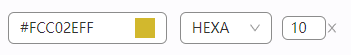

# ColorInput

## 何时使用

在有颜色输入时，该颜色输入框可提供颜色的Input框和颜色选择器

## 代码演示



::: details 查看源代码

```vue
<template>
  <h-color-input v-model:pure-color="shadowColor" />
</template>

<script setup lang="ts">
const shadowColor = ref(isDark() ? '#cccccc' : '#6D2ACA')
</script>

```

:::

## API

### Props

| 属性      | 说明     | 类型   | 默认值 |
| --------- | -------- | ------ | ------ |
| pureColor | 颜色绑定 | string |        |
