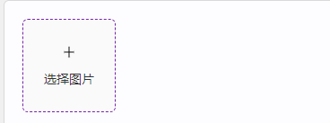

# ImagePicker

## 何时使用

在有选择图片需求时使用

## 代码演示

### 单张选择


::: details 查看源代码

```vue
<template>
  <h-image-picker />
</template>

```

:::

### 批量选择

<!-- <h-multi-image-picker /> -->


::: details 查看源代码

```vue
<template>
  <h-multi-image-picker />
</template>

```

:::

## API

### Props

| 属性        | 说明         | 类型                | 默认值 |
| ----------- | ------------ | ------------------- | ------ |
| pureColor   | 颜色绑定     | string              |        |
| width       | 宽度         | string              | 100%   |
| height      | 高度         | string              | 100%   |
| imageHeight | 图片高度     | string              | 78vh   |
| pickHook    | 图片选择钩子 | (file:File) => void |        |
| onLoadHook  | 图片挂载钩子 | (file:File) => void |        |
| resetHook   | 图片重置钩子 | (file:File) => void |        |
