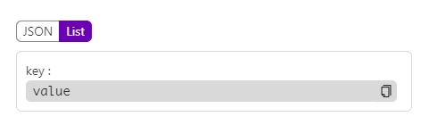

# KVResult

## 何时使用

在需要使用对象或者JSON的键值对展示时，该组件能够很好地将其进行展示

## 代码演示

<!-- <h-k-v-result :result="outputValue" :model-switch="true" />

<script setup lang="ts">
import {ref} from 'vue'

const outputValue = ref({
  a:1
})
</script> -->



::: details 查看源代码

```vue
<template>
  <h-k-v-result :result="outputValue" :model-switch="true" />
</template>

<script setup lang="ts">
import { ref } from 'vue'

const outputValue = ref({})
</script>

```

:::

## API

### Props

| 属性        | 说明             | 类型                    | 默认值 |
| ----------- | ---------------- | ----------------------- | ------ |
| result      | 需要展示的对象   | ^[Object]`Record<string,any>` |        |
| width       | 宽度             | number                  |        |
| model       | 展示模式         | list / json             | list   |
| modelSwitch | 是否禁用模式切换 | boolean                 |        |
