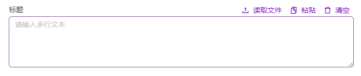

# MultilineInput

## 何时使用

在有需要使用多行输入时，该输入框使输入更加简单

## 代码演示

<!-- <template>
  <h-multiline-input v-model="text" autofocus title="标题" />
</template>

<script setup lang="ts">
const text = ref('请输入多行文本')
</script> -->



::: details 查看源代码

```vue
<template>
  <h-multiline-input v-model="text" autofocus title="标题" />
</template>

<script setup lang="ts">
const text = ref('请输入多行文本')
</script>

```

:::

## API

### Props

| 属性        | 说明         | 类型                                               | 默认值         |
| ----------- | ------------ | -------------------------------------------------- | -------------- |
| title       | 标题         | string                                             | Input content: |
| code        | 是否代码输入 | booleanfalse                                       |                |
| lang        | 显示编程语言 | [CodeEditorLanguagesUnion](#CodeEditorLanguagesUnion) |                |
| modelValue  | 绑定ref      | string                                             |                |
| autofocus   | 自动聚焦     | boolean                                            | autofocus      |
| placeholder | 占位文字     | string                                             |                |
| id          |              | string                                             |                |

### 事件

| 事件名   | 说明               | 类型   | 默认值 |
| ------ | ------------------ | ------ | ------ |
| change | 键值对改变触发事件 | Function |        |
