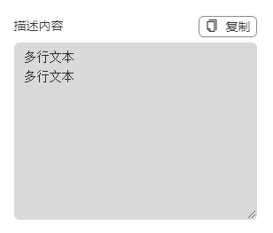

# MultilineResult

## 何时使用

在有需要使用多行文本展示时，该展示框可以提供更强大功能

## 代码演示

<!-- <template>
  <h-multiline-result :result="text" result-desc="" />
</template>

<script setup lang="ts">
import {ref} from 'vue'

const text = ref('请输入多行文本')
</script> -->



::: details 查看源代码

```vue
<template>
  <h-multiline-result :result="text" result-desc="" />
</template>

<script setup lang="ts">
const text = ref('请输入多行文本')
</script>

```

:::

## API

### Props

| 属性       | 说明         | 类型                             | 默认值 |
| ---------- | ------------ | -------------------------------- | ------ |
| title      | 标题         | string                           | result       |
| result     | 结果展示     | string                           |        |
| height     | 高度         | string                           |        |
| fileType   | 导出文件类型 | [BlobPropertyBag](#BlobPropertyBag) |        |
| outputFile | 导出文件     | any                              |        |
