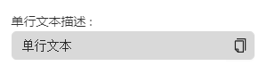

# MultilineResult

## 何时使用

在有需要使用单行输展示时，该展示框可提供更强大的功能

## 代码演示

<!-- <template>
  <h-singleline-result :result="text" result-desc="" />
</template>

<script setup lang="ts">
const text = ref('请输入多行文本')
</script> -->



::: details 查看源代码

```vue
<template>
  <h-singleline-result :result="text" result-desc="" />
</template>

<script setup lang="ts">
const text = ref('请输入多行文本')
</script>

```

:::

## API

### Props

| 属性           | 说明             | 类型    | 默认值 |
| -------------- | ---------------- | ------- | ------ |
| title          | 标题             | string  |        |
| result         | 结果展示         | string  |        |
| size           | 复制按钮大小     | string  | middle |
| showCopyButton | 是否显示复制按钮 | boolean | true   |
