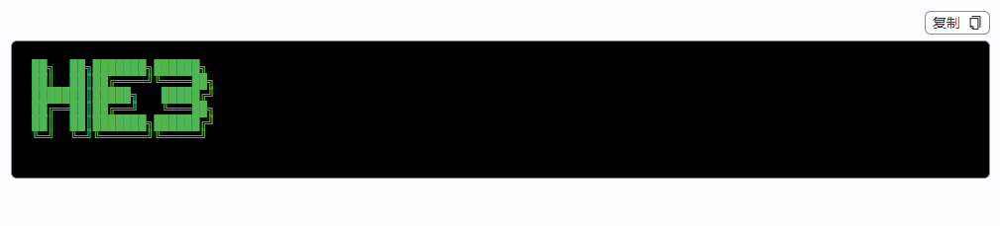

# TerminalView

## 何时使用

在有需要展示终端代码时，该组件可以提供良好的终端展示效果

## 代码演示

<!-- <template>
  <h-terminal-view :result="screen" />
</template>

<script setup lang="ts">
const screen = ref('请输入多行文本')
</script> -->



::: details 查看源代码

```vue
<template>
  <h-terminal-view :result="screen" />
</template>

<script setup lang="ts">
const screen = ref('请输入多行文本')
</script>

```

:::

## API

### Props

| 属性           | 说明             | 类型    | 默认值 |
| -------------- | ---------------- | ------- | ------ |
| result         | 结果展示         | string  |        |
