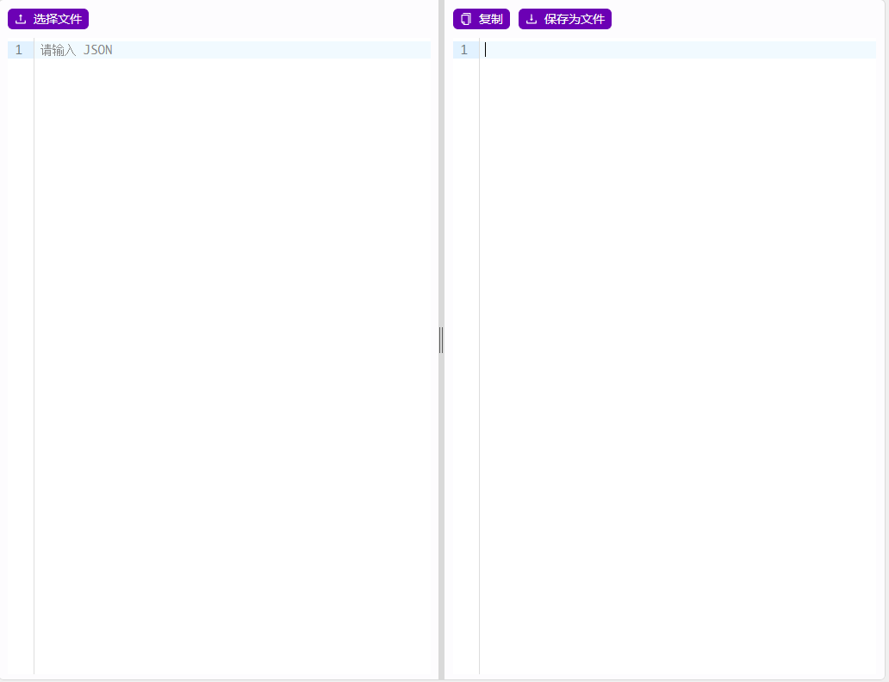

# Transform

## 何时使用

在有需要做代码转换时，该组件可以快速生成需要的ui，以及更简单的转换逻辑

## 代码演示

<!-- <template>
  <h-transform @change="handleChange" @mounted="handleMounted" />
</template>

<script setup lang="ts">
import { Ref } from 'vue';

const handleChange = (inputValue: Ref<string>) => {
  // do something
  return ''
}

const handleMounted = (inputValue: Ref<string>) => {
  // Mounted hook
}
</script> -->



::: details 查看源代码

```vue
<template>
  <h-transform @change="transform" @mounted="initTemplate" />
</template>

<script setup lang="ts">
import { Ref } from 'vue';

const transform = (inputValue: Ref<string>):string => {
  // do something
  // 将转换结果返回即可在右边进行展示，注意返回结果必须是字符串
  return ''
}

const initTemplate = (inputValue: Ref<string>) => {
  // Mounted hook
  // 用于初始化左边编辑器模板
  inputValue.value = example
}
</script>

```

:::

## API

### Props

| 属性           | 说明             | 类型                                 | 默认值 |
| -------------- | ---------------- | ------------------------------------ | ------ |
| leftConfig     | 左编辑器配置     | [Config](#config)                       |        |
| rightConfig    | 右编辑器配置     | [Config](#config)                       |        |
| canChooseFile  | 是否支持选择文件 | boolean                              | true   |
| onMounted      | 挂载钩子         | (inputValue:Ref `<string>`)=> void |        |
| onChange       | 输入框改变时钩子 | (inputValue:Ref `<string>`)=> void |        |
| onResultChange | 结果改变时钩子   | (inputValue:Ref `<string>`)=> void |        |
| autoFill       | 是否自动填入     | boolean                              | false  |
| autoFillType   | 自动填入类型     | [&#39;json&#39;](#'json')               |        |
| clipboardValue | 剪切板值         | [JudgeType](#JudgeType)                 | null   |

#### Config

| 属性        | 说明 | 类型                                               | 默认值 |
| ----------- | ---- | -------------------------------------------------- | ------ |
| placeholder |      | string                                             |        |
| editorLang  |      | [CodeEditorLanguagesUnion](#CodeEditorLanguagesUnion) |        |
| editorTheme |      | [CodeEditorThemesUnion](#CodeEditorThemesUnion)       |        |

### Slot

| 插槽名      | 说明         | 类型   | 默认值 |
| ----------- | ------------ | ------ | ------ |
| left        | 左侧按钮插槽 | Button |        |
| right       | 右侧按钮插槽 | Button |        |
